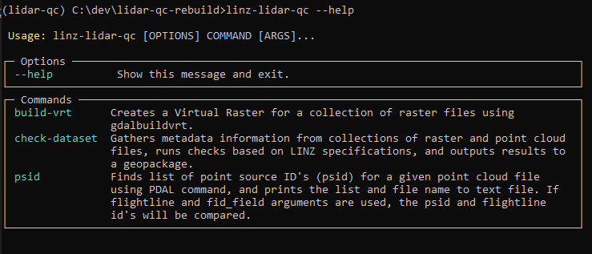
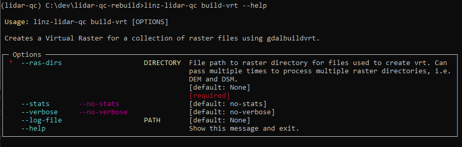
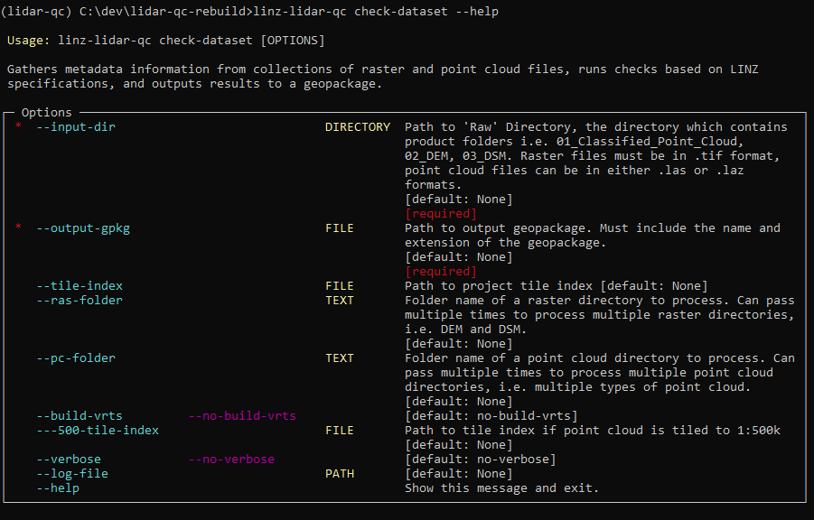
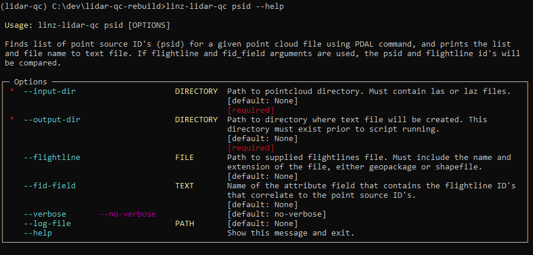

# LINZ LiDAR QC Tools
linz-lidar-qc is a command line application that consists of tools to aid in quality checking LiDAR data, created by Toitū Te Whenua Land Information New Zealand.

## Installation
Store code locally and install Anaconda. 

In the Anaconda Terminal, navigate into the directory where the code is stored (using cd), and use the environment yml file to create a conda virtual environment:
```bash
conda env create -f environment.yml
```

Activate the environment:
```bash
conda activate lidar-qc
```

Install the application:
```bash
pip install --editable .
```

## Usage
The application is called using linz-lidar-qc. Use `--help` for more information on the application.

<p align="center">
    
</p>

There are currently 3 commands on the application. More commands will be added as development continues. 

### build-vrt
Creates a virtual raster for a directory of tif files.
<p align="center">
    
</p>

Basic usage:
`--ras-dirs` can be used more than once in command line.
```bash
linz-lidar-qc build-vrt --ras-dirs H:\lidar-dataset\Raw\DEM
```


### check-dataset
Gathers metadata information on all products of LiDAR data (raster and point clouds) and outputs information to a geopackage. 
This tool also checks the tiling of a dataset.
<p align="center">
    
</p>

Basic usage:

`--input-dir` assumes a file structure where all 3 product folders are within a parent directory. 
The script will look in the parent directory and run the script on any folder names that cotain laz/las/point/dem/dsm (capitalisation is fine). 
```bash
linz-lidar-qc check-dataset --input-dir H:\lidar-dataset\Raw --output-gpkg H:\lidar-dataset\Processed\metadata_output.gpkg
```

To check product file numbers against tile-index feature number:
```bash
linz-lidar-qc check-dataset --input-dir H:\lidar-dataset\Raw --output-gpkg H:\lidar-dataset\Processed\metadata_output.gpkg --tile-index H:\lidar-dataset\Raw\tile_index.shp
```

To run the command on 1 child folder, use `--ras-folder` or `--pc-folder`:
```bash
linz-lidar-qc check-dataset --input-dir H:\lidar-dataset\Raw --output-gpkg H:\lidar-dataset\Processed\metadata_output.gpkg --ras-folder DEM
```

### psid
Creates a text file that contains a pointcloud file name and a list of the point source ID's in that file.
<p align="center">
    
</p>

Basic usage:
`--output-dir` is the location where the output text file will be created.
```bash
linz-lidar-qc psid --input-dir H:\lidar-dataset\Raw\Point_cloud --output-dir H:\lidar-dataset\Processed
```

To compare point source ID's for a dataset against the flightline ID's use both `--flightline` and `--fid-field`
```bash
linz-lidar-qc psid --input-dir H:\lidar-dataset\Raw\Point_cloud --output-dir H:\lidar-dataset\Processed --flightline H:\lidar-dataset\Raw\flightline.shp --fid-field FLIGHT_LIN
```


