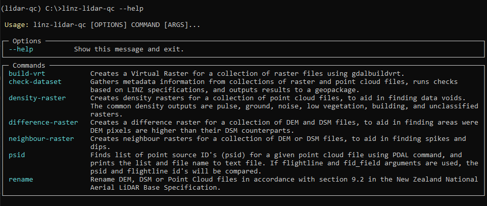

# Toitū Te Whenua LINZ LiDAR QC Application
linz-lidar-qc is a command line application that consists of tools to aid in quality checking LiDAR data, created by Toitū Te Whenua Land Information New Zealand.

## Installation
Store code locally and install Anaconda. 

In the Anaconda Terminal, navigate into the directory where the code is stored (using cd), and use the environment yml file to create a conda virtual environment:
```bash
conda env create -f environment.yml
```

Activate the environment:
```bash
conda activate lidar-qc
```

Install the application:
```bash
pip install --editable .
```

## License
This repository is licensed under the MIT license. For more information see the [license file](./LICENSE).

## Usage
The application is called using linz-lidar-qc. Use `--help` for more information on the application.

<p align="left">
    
</p>

There are currently 4 commands on the application. More commands will be added as development continues. 

### build-vrt
Creates a virtual raster for a directory of tif files.

Basic usage:
`--input` can be used more than once in command line.
```bash
linz-lidar-qc build-vrt --input H:\lidar-dataset\Raw\DEM
```

### check-dataset
Gathers metadata information on all products of LiDAR data (raster and point clouds) and outputs information to a geopackage. 
This tool also checks the tiling of a dataset.
Use the `--build-vrt` argument to build vrts for the raster folders.

Basic usage:
`--input` assumes a file structure where all 3 product folders are within a parent directory. 
The script will look in the parent directory and run the script on any folder names that cotain laz/las/point/dem/dsm (capitalisation is fine). `--output` is the location and name for the geopackage that gets created.
```bash
linz-lidar-qc check-dataset --input H:\lidar-dataset\Raw --output H:\lidar-dataset\Processed\metadata_output.gpkg
```

To check product file numbers against tile-index feature number:
```bash
linz-lidar-qc check-dataset --input H:\lidar-dataset\Raw --output H:\lidar-dataset\Processed\metadata_output.gpkg --tile-index H:\lidar-dataset\Raw\tile_index.shp
```

To run the command on 1 child folder, use `--ras-folder` and/or `--pc-folder`:
```bash
linz-lidar-qc check-dataset --input-dir H:\lidar-dataset\Raw --output-gpkg H:\lidar-dataset\Processed\metadata_output.gpkg --ras-folder DEM --pc-folder LAZ
```

### density-raster
Creates a density raster vrt from the point clouds, based on a point cloud filter. Use `--help` to see all the filter options.

Basic usage:
`--input` is the location of the point cloud folder and `--filter` is how the point clouds will be filtered to create the density raster.
```bash
linz-lidar-qc density-raster --input H:\lidar-dataset\Raw\LAZ --filter ground
```

To run a series of pre-set density rasters, use the filter 'common'. This will create a density raster for pulse, ground, low vegetation, buildings, unclassified, and noise.
```bash
linz-lidar-qc density-raster --input H:\lidar-dataset\Raw\LAZ --filter common
```

### psid
Creates a text file that contains a pointcloud file name and a list of the point source ID's in that file.

Basic usage:
`--input` is the location of the point cloud folder and `--output` is the location where the output text file will be created.
```bash
linz-lidar-qc psid --input H:\lidar-dataset\Raw\Point_cloud --output H:\lidar-dataset\Processed
```

To compare point source ID's for a dataset against the flightline ID's use both `--flightline` and `--fid-field`
```bash
linz-lidar-qc psid --input H:\lidar-dataset\Raw\Point_cloud --output H:\lidar-dataset\Processed --flightline H:\lidar-dataset\Raw\flightline.shp --fid-field FLIGHT_LIN
```


